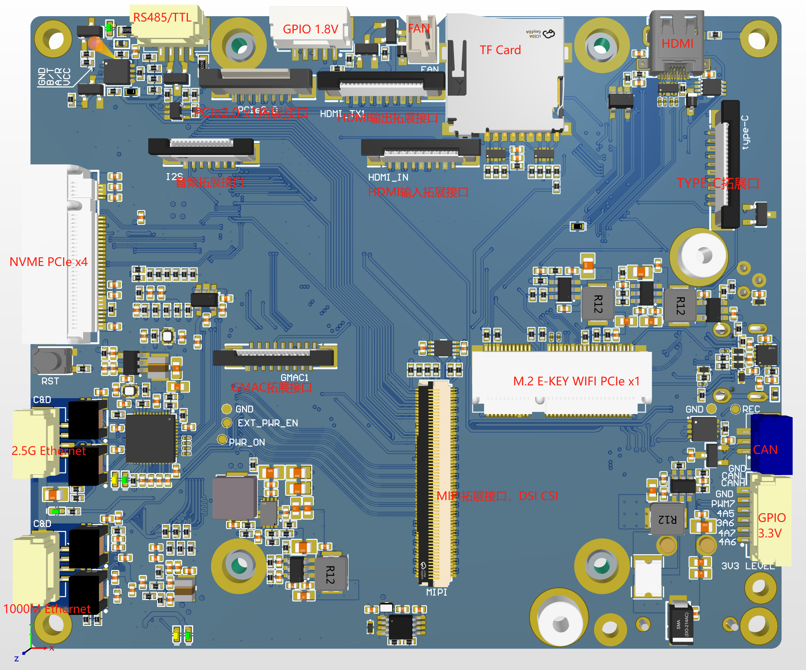
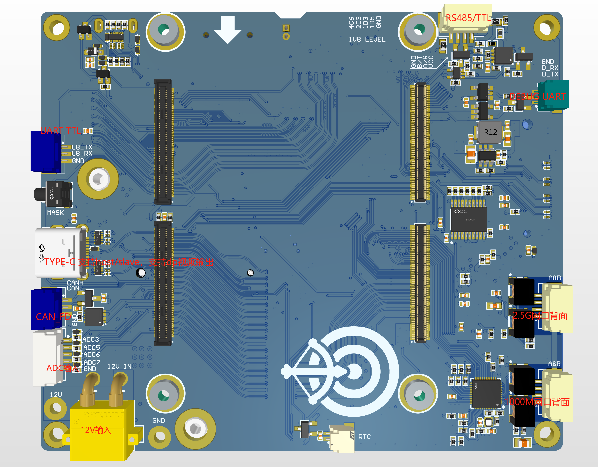

# 概要

	本产品使用RK3588为核心，拓展多种机器人行业所需的常用接口。
	适用于各种机器人开发行业，如：
	- 无人机
	- 移动机器人
	- 机械臂
	- 人形机器人
RK3588内置了6TOPS的强悍算力，可以支持边缘端推理应用。如[目标检测网络Yolov8最快可高达85fps](https://www.bilibili.com/video/BV1tr421x7XH/?spm_id_from=333.1387.search.video_card.click), [单目深度估计](https://www.bilibili.com/video/BV1d9Nae9EeY/?spm_id_from=333.1387.search.video_card.click) 等应用。本产品集成完成的常用接口，如RS485， CAN， Ethercat/Ethernet。
提供完善的软件支持，如开箱即可测试的Ethercat程序等。
联系方式: jp.chen@siat.ac.cn

# 产品参数

|           | 描述                                                                                                          |
| --------- | ----------------------------------------------------------------------------------------------------------- |
| 长宽        | 9.5cm x 8.0cm                                                                                               |
| 制程        | 8nm                                                                                                         |
| 指令集       | ARMv8-A(64bit)                                                                                              |
| CPU       | 4x Cortex-A76 @ 2.4GHz   4x Cortex-A55 @ 1.8GHz                                                          |
| GPU       | ARM Mali-G610 MP4                                                                                           |
| NPU       | 6 TOPS                                                                                                      |
| 配置        | 4+32; 8+64; 16+128                                                                                          |
| RS485/TTL | 两路，可以通过跳线电阻切换                                                                                               |
| TTL       | 一路                                                                                                          |
| TF card   | 一路                                                                                                          |
| HDMI      | 一路 microHDMI                                                                                                |
| CAN_FD    | 两路                                                                                                          |
| 1000M以太网  | 一路 支持硬件PTP                                                                                                  |
| 2.5G以太网   | 一路 支持硬件加速的Ethercat主站                                                                                        |
| NVME      | 一路 PCIE3.0 x4                                                                                               |
| WIFI      | 一路 M.2 E_KEY                                                                                                |
| TYPE-C    | 一路 全功能TYPE-C，支持DP输出                                                                                         |
| ADC       | 4路 ADC输入                                                                                                    |
| GPIO      | 两个GPIO接口，1.8V和3.3V                                                                                          |
| 电源输入      | XT-30 12V输入                                                                                                 |
| RTC       | RTC电池输入接口                                                                                                   |
| 拓展        | 一路 音频接口 一路 PCIe2.0 X1 一路HDMI IN 一路HDMI OUT 一路 GMAC 一路 全功能TYPE-C 六路 CSI摄像头输入 两路 DSI视频输出 |

# 软件支持
	本产品提供Ubuntu22.04镜像，内置NPU 0.9.8版本，can和Ethercat主站等驱动。
## 目标检测
本产品完美支持我开源的 [多线程目标检测推理](https://github.com/kaylorchen/ai_framework_demo)，使用通用推理框架，实现统一源码，完美的在PC端开发，RK3588端直接部署
## Ethercat功能
  
使用Ethercat功能的时候，本产品使用实时内核，使用专用的ethercat的网卡驱动，最大限度降低Ethercat的延迟，提高通信的性能